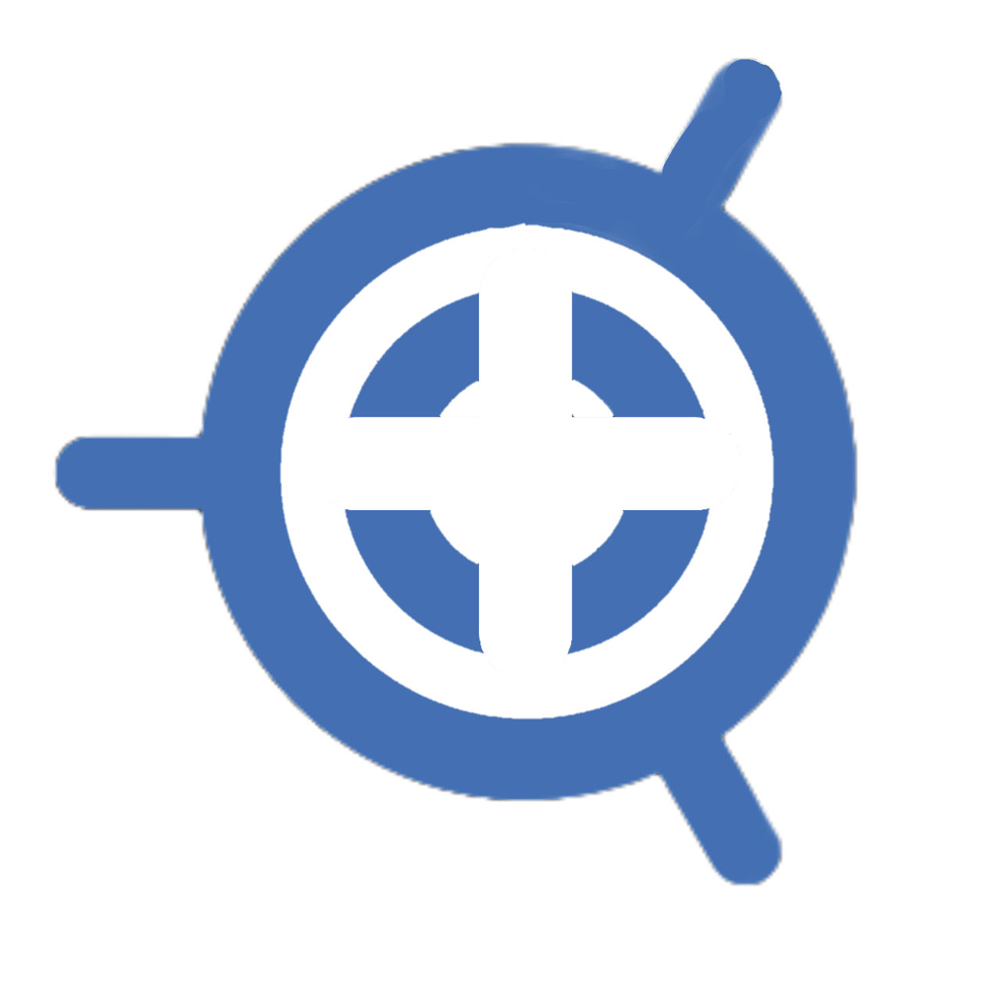

Autodarts +
===========

     

* * *

> \[!CAUTION\] **AutoDarts +** is developed by the community and is not an integral part of the official Autodarts platform.

📋 Overview
-----------

AutoDarts + is a browser extension that enhances your experience on [autodarts.io](https://autodarts.io). It adds quality-of-life features, customization options, and advanced functionality to make your Autodarts experience more enjoyable and personalized.

💾 Installation
---------------

### 🌐 Browser Extensions

*   [Microsft Add-ons](https://microsoftedge.microsoft.com/addons/detail/customize-darts-for-autod/emckdnomcmmjiimehoiakppgmmcfagdn)
*   [Firefox Add-ons](https://addons.mozilla.org/de/firefox/addon/autodarts-plus)

📑 Table of Contents
====================

*   [Overview](#-overview)
*   [Installation](#-installation)
*   [Features](#-features)
    *   [Match Customization](#-match-customization)
    *   [Gameplay Features](#-gameplay-features)
*   [Configuration](#%EF%B8%8F-configuration)
*   [Development](#-development)
*   [Contributing](#-contributing)
*   [Show your support](#%EF%B8%8F-show-your-support)
*   [Credits](#-credits)
*   [License](#-license)

✨ Features
----------

### 🎨 Match Customization

*   **Darts Customization**: Desing your own unique darts or import custom SVG code

### 🎮 Gameplay Features

*   **Local tournaments**: Create your own local tournaments with KO, league or groups

###   

⚙️ Configuration
----------------

The extension provides a comprehensive settings panel where you can configure all features according to your preferences:

*   Enable/disable individual features
*   Customize colors and appearance
*   Set timing for automatic actions
*   Configure Discord webhook integration
*   Adjust sound settings and upload custom sounds
*   Customize streaming mode settings

### 📤 Settings Import/Export

The extension allows you to easily transfer your settings between devices or create backups:

*   **Export Settings**: Download your current configuration as a file
*   **Import Settings**: Load settings from a previously exported file
*   **Copy to Clipboard**: Copy your settings to the clipboard for easy sharing
*   **Paste from Clipboard**: Apply settings that were copied from another installation
*   **Reset Settings**: Restore all settings to their default values through the Danger Zone section

This makes it simple to:

*   Back up your perfect configuration
*   Share your setup with friends
*   Transfer settings between browsers or devices
*   Restore settings after reinstalling the extension
*   Start fresh with default settings when needed

👨‍💻 Development
-----------------

This project is built using:

*   Javascript

### 🚀 Getting Started

    # Install dependencies
    yarn install
    
    # Start development server
    yarn dev
    
    # Build for production
    yarn build
    
    # Build for Firefox
    yarn build:firefox
    
    # Create distribution zip
    yarn zip
    

🤝 Contributing
---------------

Contributions are welcome! Please feel free to submit a Pull Request or create an issue if you have ideas for improvements or have found a bug.

Feel free to fork and make a Pull Request to this plugin project. All the input is warmly welcome!

⭐️ Show your support
--------------------

Give a star if this project helped you.

👏 Credits
----------

🎯 [Autodarts](https://autodarts.io) - The original platform this extension enhances  
🎨 Alex - Actual creator of the tournaments

📄 License
----------

This project is licensed under the [Creative Commons Attribution-NonCommercial 4.0 International License (CC BY-NC 4.0)](LICENSE) - see the [LICENSE](LICENSE) file for details.

Under this license:

*   **Attribution** — You must give appropriate credit, provide a link to this project, and indicate if changes were made.
*   **NonCommercial** — You may not use this project for commercial purposes or monetary compensation.
